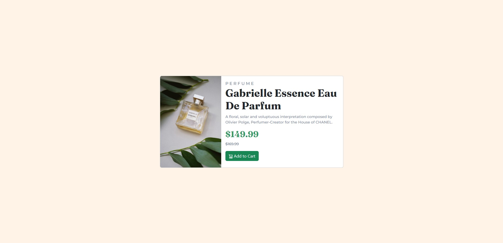

# Frontend Mentor - Product preview card component solution

This is a solution to the [Product preview card component challenge on Frontend Mentor](https://www.frontendmentor.io/challenges/product-preview-card-component-GO7UmttRfa). Frontend Mentor challenges help you improve your coding skills by building realistic projects. 

## Table of contents

- [Overview](#overview)
  - [The challenge](#the-challenge)
  - [Screenshot](#screenshot)
  - [Links](#links)
- [My process](#my-process)
  - [Built with](#built-with)
  - [What I learned](#what-i-learned)
  - [Continued development](#continued-development)
  - [Useful resources](#useful-resources)
- [Author](#author)
- [Acknowledgments](#acknowledgments)

## Overview

### The challenge

Users should be able to:

- View the optimal layout depending on their device's screen size
- See hover and focus states for interactive elements

### Screenshot

### Links

- Solution URL: [Add solution URL here](https://your-solution-url.com)
- Live Site URL: [Add live site URL here](https://your-live-site-url.com)

## My process

### Built with

- Semantic HTML5 markup
- CSS custom properties
- Bootstrap

### What I learned

I learned whilst carrying out this challenge, if I wanted my card to be centered verically and horizontally, the best way to do this was to wrap the card inside a parent element, sized the parent at 100vh (full screen) and then begin the CSS to center the card.

### Continued development

//

### Useful resources

- [Responsive Design](https://stackoverflow.com/questions/30460681/changing-image-src-depending-on-screen-size) - This helped me to change the images depending on which screen size was being used for viewing the product card.

## Author

- Github - (https://github.com/BPark44)

## Acknowledgments

//